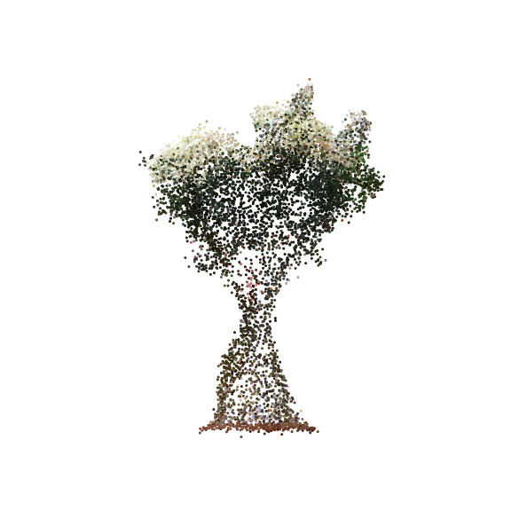

# Simple DDPM Scheduler

Example of usage:


```Python
time_dim = 128
data_dim = 3
pos_dim = 32 * data_dim
diffusion_steps = 512
n_epochs = 10_000

k = jax.random.key(0)

net = MLP(pos_dim, time_dim, 256, data_dim, 6, k)

diffusion = DDPM(
    model=net,
    data=data,
    steps=diffusion_steps,
    data_shape=(data_dim, ),
    batch_size=8192,
    betas=(1e-4, 0.02)
)

for _ in range(n_epochs):
    k, _ = jax.random.split(k, 2)
    diffusion.run_epoch(k)

y = diffusion.sample(k, 10_000)
```

## Fitting a 3D Point Cloud

<p align="center">
  
</p>

Source: [Point Cloud of Roses (Sketchfab)](https://sketchfab.com/3d-models/a-point-cloud-of-roses-13495f32fe1340fe91fd35a42c0a76c3)